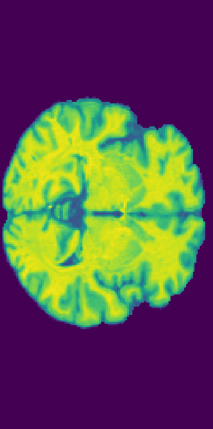
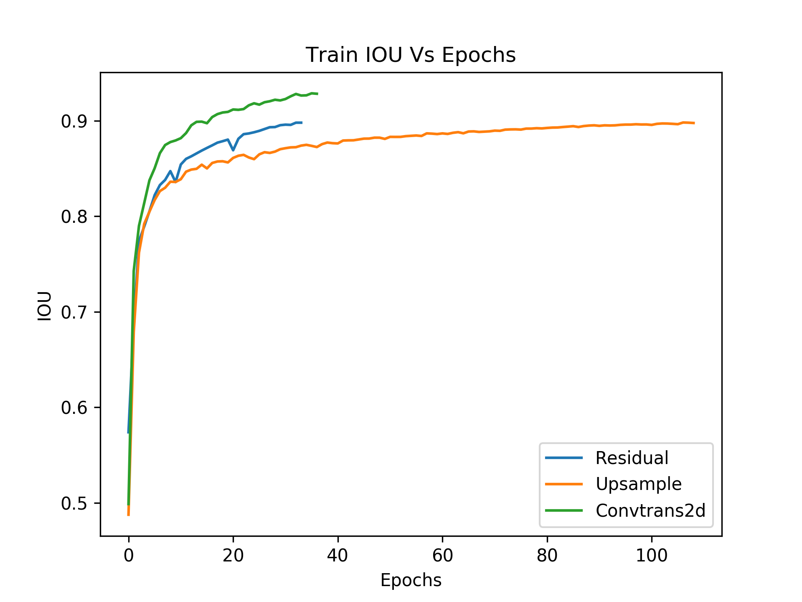
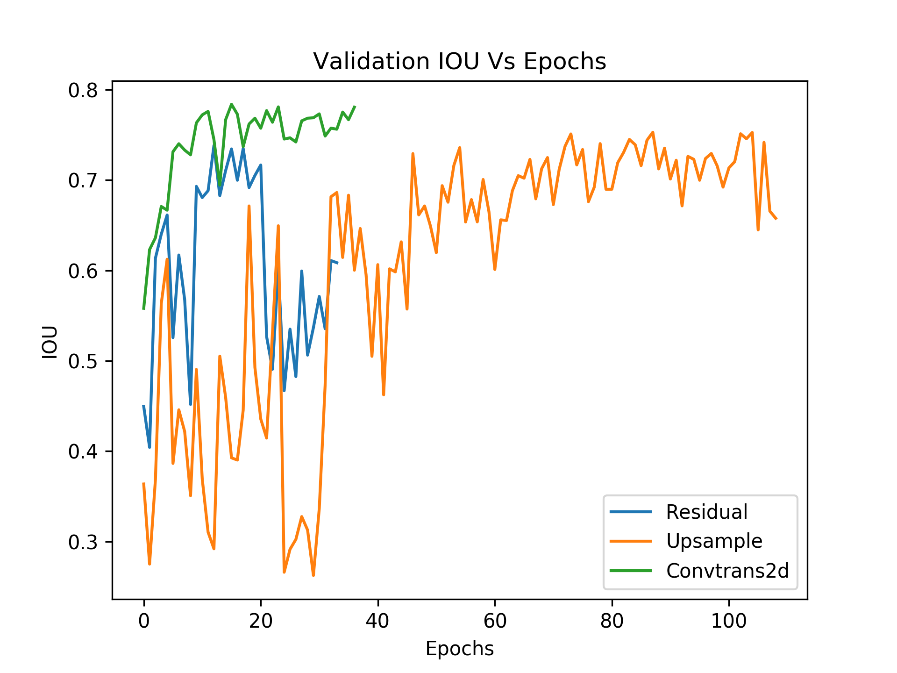
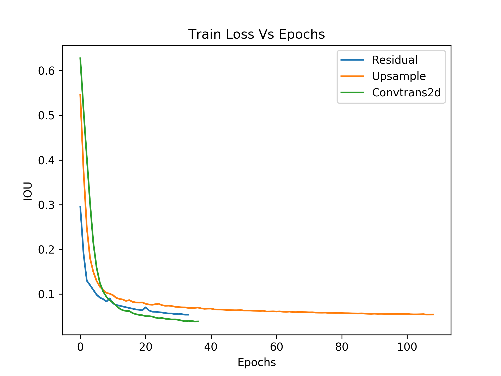
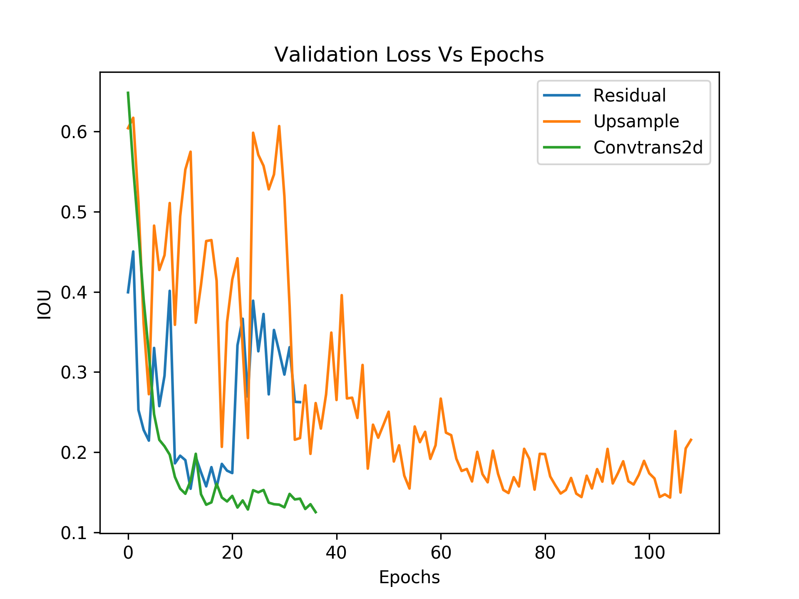

# mri_segmentation


# Audio classification using CNN and LSTM

<!-- Foobar is a Python library for dealing with word pluralization. -->

## Data Visualization

Input Image             |  Ground Truth
:-------------------------:|:-------------------------:
   |  


## Results


<table>
  <tr>
    <th></th>
    <th>Validation IOU</th>
    <th>Validation Loss</th>
  </tr>
  <tr>
    <td>Upsample</td>
    <td>0.752</td>
    <td>0.144</td>
  </tr>
  <tr>
    <td>Convtrans2d</td>
    <td>0.783</td>
    <td>0.134</td>
  </tr>
  <tr>
    <td>Skip Connections</td>
    <td>0.743</td>
    <td>0.149</td>
  </tr>
</table>

### Training IOU Plot




### Validation IOU Plot



### Training Error Plot



### Validation Error Plot




## Installation

Use the package manager [pip](https://pip.pypa.io/en/stable/) to install foobar.

```bash
pip install requirements.txt 
```

or

```bash
conda create --name <env> --file requirements.txt 
```

## Usage


### Train and Test
```bash
python codes/baseline/main.py
```


## Contributing
Pull requests are welcome. For major changes, please open an issue first to discuss what you would like to change.

Please make sure to update tests as appropriate.


## License
[MIT](https://choosealicense.com/licenses/mit/)